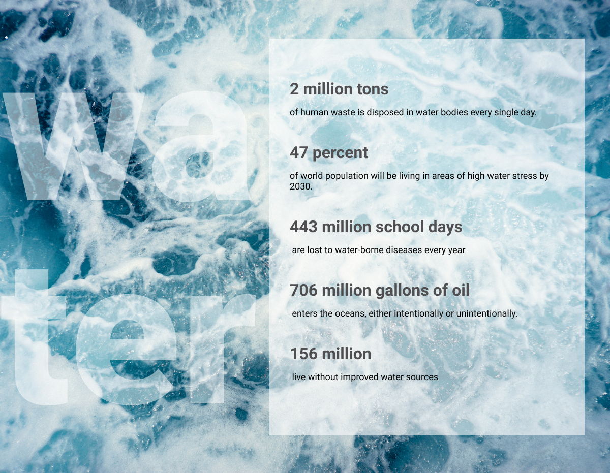

# Water Pollution Stats

Follow the example image:

and create a water pollution awareness mini page.

Must have:

- [x] the page fills the entire browser
- [x] stats box is aligned to the right of the browser
- [x] stats box takes roughly a bit less than half the screen
- [x] stats box is semi-transparent

Extra:

- [x] stats headlines are a shade of gray (instead of true black) and bigger than stats text
- [x] make sure when the screen get very small height, that the content is still readable
- [x] add semi-transparent text `water` as decorational text (not selectable)
